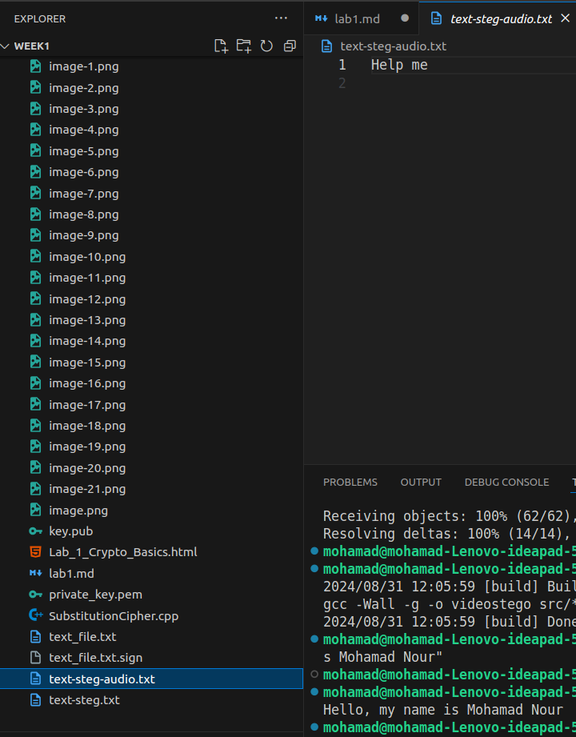
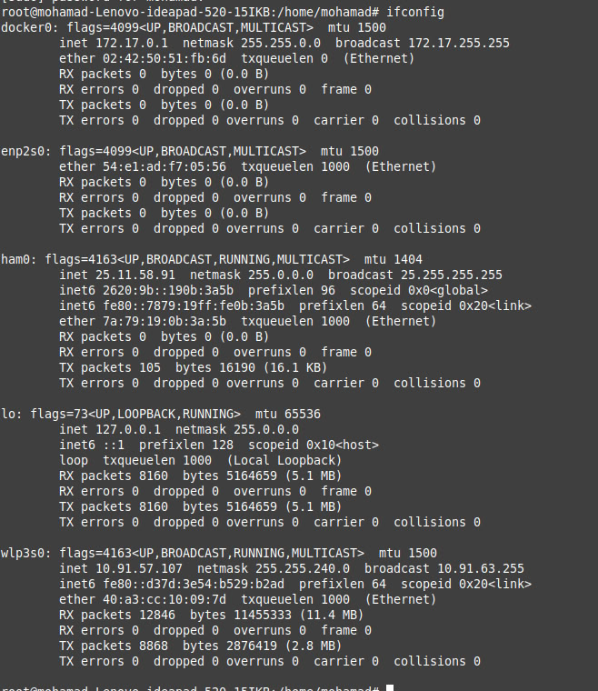
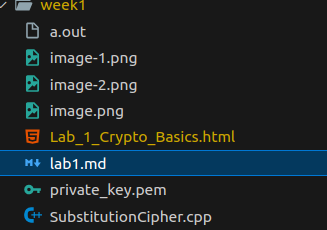
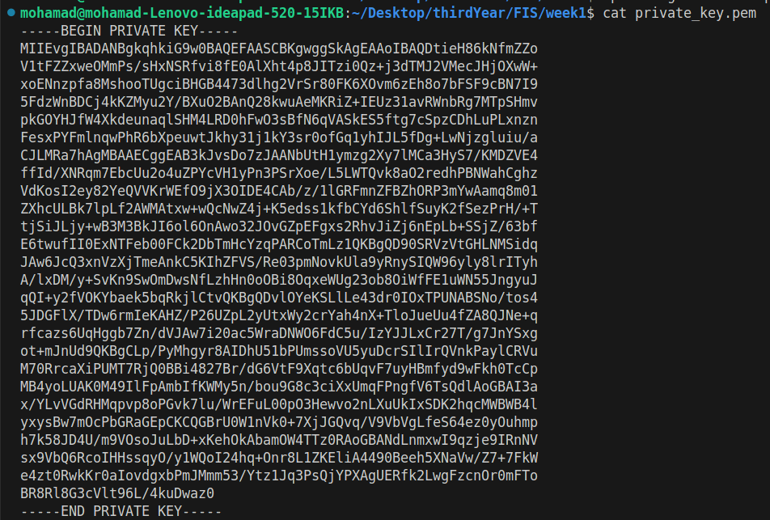
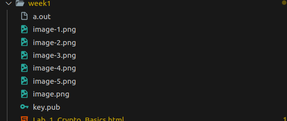
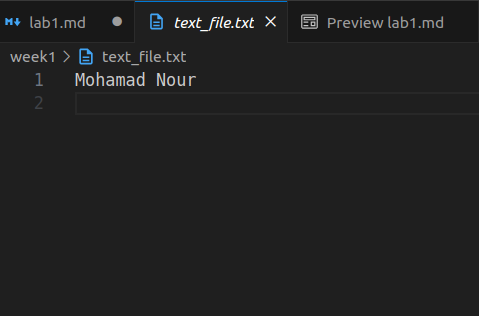
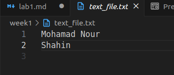

# FIS Lab 1: Crypto Basics

### Name: Mohamad Nour Shahin
### Group number: B22-CBS-01


# Questions to Answer

- Upload all relevant program/scripts created to Moodle.
- Show all relevant input, commands executed, and output in the form of screenshots.
- Use tunnelshell for the ICMP/DNS format in steganography. You can run it on 2 virtual machines, you can also pair with someone else and use their computer as the victim or the attacker.

## Task 1

Write a program that implements **one** of the following algorithms for both encryption and decryption.

- Substitution Cipher
- Transposition Cipher
- Rotor Machines or Simple XOR

**Hint**  
http://www.crypto-it.net/eng/simple/index.html

---

### Solution:

I choosed the Substitution Cipher, and the code below represnet it.

### Code:

# Encryption and Decryption Program

```cpp
#include <bits/stdc++.h>
using namespace std;

// Declare global strings for language, plain text, cipher text, and decrypted cipher
string language, plain_text, cipher_text, decrypt_cipher;

int main()
{
    // Declare a key for shifting letters
    int key;

    // Declare maps to store encryption and decryption mappings
    map<char, char> dictionary_lang, dictionary_cipher;

    // Prompt user to enter the language (alphabet) used for encryption
    cout << "Enter your language letters please:\n";
    cin >> language;

    // Prompt user to enter a key for shifting letters
    cout << "Enter the key you want to use in hashing:\n";
    cin >> key;

    // Ignore leftover newline character in the input buffer
    cin.ignore();

    // Create the encryption dictionary by shifting letters by the key value
    for (int i = 0; i < language.length(); i++)
    {
        dictionary_lang[language[i]] = language[(i + key) % language.length()];
    }

    // Prompt user to enter the plain text to be encrypted
    cout << "Enter your plain text please:\n";
    getline(cin, plain_text);

    // Encrypt the plain text using the encryption dictionary
    for (char &c : plain_text)
    {
        if (dictionary_lang.find(c) != dictionary_lang.end())
        {
            cipher_text += dictionary_lang[c]; // Replace with encrypted character
        }
        else
        {
            cipher_text += c; // Leave non-language characters unchanged
        }
    }

    // Output the cipher text (encrypted text)
    cout << "Your cipher text is: " << cipher_text << "\n";

    // Create the decryption dictionary by shifting letters backwards by the key value
    for (int i = 0; i < language.length(); i++)
    {
        dictionary_cipher[language[i]] = language[(i - key + language.length()) % language.length()];
    }

    // Decrypt the cipher text using the decryption dictionary
    for (char &c : cipher_text)
    {
        if (dictionary_cipher.find(c) != dictionary_cipher.end())
        {
            decrypt_cipher += dictionary_cipher[c]; // Replace with decrypted character
        }
        else
        {
            decrypt_cipher += c; // Leave non-language characters unchanged
        }
    }

    // Output the recovered plain text (decrypted text)
    cout << "Recovered plain text : " << decrypt_cipher << "\n";
    return 0;
}
```


---

## Task 2

Hide data (e.g text) in another data file format. The data should be hidden in the following formats


- Video
- Audio
- ICMP/DNS


---


### Solution:

1. Video: I will use third party tool from github [JavDomGom/videostego](https://github.com/JavDomGom/videostego).
- clone the repo and build it:
```command
git clone https://github.com/JavDomGom/videostego.git
cd videostego
make build
```

- I will use one of the video samples to hide the data that I want to hide it:
```command
./videostego -f ./mp4/sample_1.mp4  -w -m "Hello, my name is Mohamad Nour"
```


- to check the hidden message inside the video i will use the command:
```command
./videostego -f ./mp4/sample_1.mp4 -r
```


---

2. Audio:  I will use steghide from lab itself:


- Create a text file that contains the message you want to embed in the audio:
```command
echo "Help me" > text-steg-audio.txt
```




- Embed the text in the audio:
```command
steghide embed -cf file_example_WAV_1MG.wav -ef text-steg-audio.txt
```


- View the embedded text after deleting the txt file:
```command
steghide extract -sf file_example_WAV_1MG.wav -xf tes.txt
```


3. ICMP: I did it with my friend Ali hamdan's computer as victim:

check the ips of each device:
- mine:

- Ali:


- Run tunnelshell on the victim machine:
```command
sudo ./tunneld -t icmp -m echo-reply,echo
```
- Run tunnelshell on the attacker’s machine with:
```command
sudo ./tunnel -t icmp -m echo-reply,echo 10.91.55.205
```


## Task 3

Generate a RSA keypair of key length 2048-bit using OpenSSL. Write your first name in a text file, sign, and verify the integrity of the text file. Your answer should include these:


- Generate the private key with OpenSSL
- Extract the public key from the private key
- Create a text file that includes your first name
- Verify the digital signature using OpenSSL digest (dgst)


---


### Solution:


1.  Generate the private key with OpenSSL using Command:
```command
openssl genrsa -out private_key.pem 2048
```




2. view the private key file using Command:
```command
cat private_key.pem
```

3. Extract the public key from the private key using Command:
```command
openssl rsa -in private_key.pem -pubout > key.pub
```




4. View the public key file using command:
```command
cat key.pub
```


5. Create a text file that includes your first name:
```command
echo 'Mohamad Nour' > text_file.txt
```




6. Sign the text file with OpenSSL digest (dgst) using command :
```command
openssl dgst -sign private_key.pem -keyform PEM -sha256 -out text_file.txt.sign -binary text_file.txt
```


7. Verify the digital signature using OpenSSL digest (dgst) using command:
```command
openssl dgst -verify key.pub -keyform PEM -sha256 -signature text_file.txt.sign -binary text_file.txt
```


---


## Task 4

Add your last name to the text file from task 3. Now verify the text file by using the previous signature you created for your first name. Is the verification succesful?


---


### Solution:

1. Add your last name to the text file from task 3 using Command:
```command
echo 'Shahin' >> text_file.txt
```



2. verify the text file by using the previous signature you created for your first name using command:

```command
openssl dgst -verify key.pub -keyform PEM -sha256 -signature text_file.txt.sign -binary text_file.txt
```


### conclusion:

The verification was not successful because the signature was created for the first name only and not for the full name.


---


## Task 5

Decode the following ceasar cipher:
**Decode the following Caesar cipher:**
> Vwrwbu gcas roho wg ybckb og sbqfmdhwcb. Kvsb dzowb hslh wg sbqfmdhsr wh psqcasg ibfsoropzs obr wg ybckb og qwdvsfhslh. Wb o Gipghwhihwcb qwdvsf, obm qvofoqhsf ct dzowb hslh tfca hvs uwjsb twlsr gsh ct qvofoqhsfg wg gipghwhihsr pm gcas chvsf qvofoqhsf tfca hvs goas gsh rsdsbrwbu cb o ysm. Tcf sloadzs kwhv o gvwth ct 1, O kcizr ps fsdzoqsr pm P, P kcizr psqcas Q, obr gc cb.


---


### Solution:
The key used for shifting is 14:

Hiding some data is known as encryption. When plain text is encrypted it becomes unreadable and is known as ciphertext. In a Substitution cipher, any character of plain text from the given fixed set of characters is substituted by some other character from the same set depending on a key. For example with a shift of 1, A would be replaced by B, B would become C, and so on.


## Referneces:

[Task 3,4](https://pagefault.blog/2019/04/22/how-to-sign-and-verify-using-openssl/)
[Task 2](https://github.com/JavDomGom/videostego)
[Task 1](https://www.geeksforgeeks.org/substitution-cipher/)
[Task 5](https://cryptii.com/pipes/caesar-cipher)

